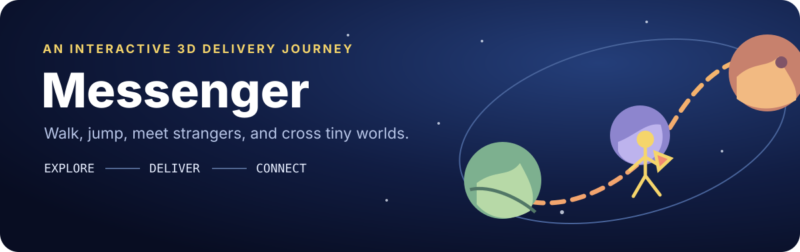

<p align="center">
  
</p>

# Messenger

**A browser-based 3D delivery journey rebuilt with Next.js, React Three Fiber, and Three.js.**

[Enter the live experience](https://promptwhisper.github.io/messenger/) · [View source](https://github.com/promptwhisper/messenger)

Walk across a small planet, meet animated characters, change your outfit, and explore a responsive WebGL world with sound, collision, and camera-relative movement.

## Controls

| Desktop | Action |
| --- | --- |
| `WASD` or arrow keys | Move |
| `Shift` | Sprint |
| `Space` | Jump |
| `E` | Interact |
| Pointer drag | Rotate the camera |
| Mouse wheel | Zoom |

Touch devices receive an on-screen analog stick with sprint on the outer ring plus a dedicated jump button.

## What is rebuilt

- animated intro and interactive planet;
- playable character with walking, sprinting, jumping, gravity, and a follow camera;
- terrain collision and animated NPC paths;
- outfit customization and multiple visual styles;
- positional dialogue, music, sound effects, and UI audio;
- responsive desktop and mobile input;
- tiered DPR, shadow, and touch settings for different devices.

The runtime is an independent React Three Fiber implementation. The original website's compiled application code is not included.

## Run locally

Requirements: Node.js 24+ and pnpm 11.

```bash
pnpm install
pnpm dev
```

Open <http://localhost:3000>.

Run the complete repository check:

```bash
pnpm check
```

Or execute each stage separately:

```bash
pnpm lint
pnpm typecheck
pnpm build
```

## Architecture at a glance

```text
keyboard / touch
       ↓
shared input state
       ↓
avatar + spherical movement + collision
       ↓
camera, NPCs, wardrobe, audio, post-processing
```

| Layer | Technology |
| --- | --- |
| Application | Next.js 16, React 19, TypeScript |
| 3D runtime | Three.js, React Three Fiber, drei |
| Visual finish | React Three Postprocessing |
| Styling | Tailwind CSS |
| Assets | Draco geometry, textures, LUT data, fonts, and OGG audio |

## Deployment

The repository includes a GitHub Pages workflow. Pushes to `main` create and publish a static export.

## Independent study and asset rights

This is an independent, non-commercial technical study created for learning and demonstration. It is not affiliated with, endorsed by, or an official release of the [original experience](https://messenger.abeto.co/).

本项目为独立的非商业学习与技术研究作品，仅用于学习、交流和演示；与原网站及其创作者不存在隶属、授权或官方合作关系。

All trademarks, visual designs, models, textures, audio, and other third-party materials belong to their respective owners. Do not use those materials for commercial sale, paid redistribution, or another purpose not permitted by the relevant rights holder. If content infringes your rights, please open an issue for review and removal.

所有商标、视觉设计、模型、贴图、音频及其他第三方素材的权利均归其各自权利人所有。如相关内容侵犯了你的合法权益，请提交 Issue 联系处理，核实后将及时修改或删除。

## License

Original source code in this repository is available under the [MIT License](LICENSE). That license does not grant rights to third-party assets, branding, or content. See [the asset notes](docs/ASSET_LICENSES.md) for details.
